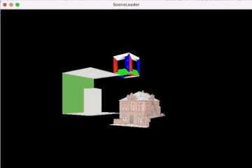

#  SceneLoader

*SceneLoader* is a project for learning how to load popular graphics-related file formats like USD and OBJ. 

## Results

Here we used Swift and Metal to load and render different models into a common scene. Rendering with ilumination will be the topic of a different project. The chosen models were:

- "Southern District Police Station" (https://sketchfab.com/3d-models/southern-district-police-station-3353cf5bfbda4b8797e845594b0cbfa7) by Katie Wolfe (https://sketchfab.com/katiewolfe) licensed under CC-BY-4.0 (http://creativecommons.org/licenses/by/4.0/). In OBJ format
- "Original CornellBox" (http://www.graphics.cornell.edu/online/box/data.html) in USDZ format
- "Box" included in the source files under "Resources/Box". In OBJ format

